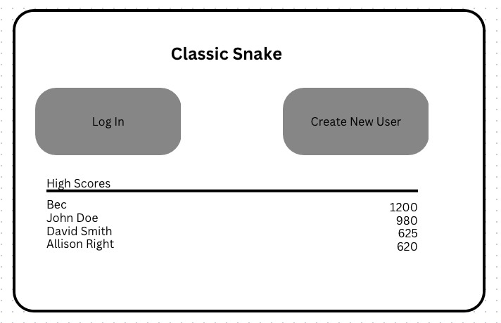

# snake

Classic Snake Game

-   Build the view
-   Logic for snake to grow
-   Logiv for hitting edges and self
-   score
-   Score log
-   User login
-   Highscores for different users

## backend

-   user login
-   database with scores
-   MVC (model view controlled)
-   Controllers folder - express webserver

-   Review the old projects from Coding Course.

-- package JSON files
-- client directory
-- server directory
-- How did we link it all together?

-   Can you build in react?
-   Refer: https://github.com/tonesfrantz/aka-izakaya
-   Pay attention to package.JSON files

---

-   Host your site on GITHUB. and use go-daddy account
-   LInks to projects.
-   Start Job hunt.

-   Going to use the MERN stack to build this

